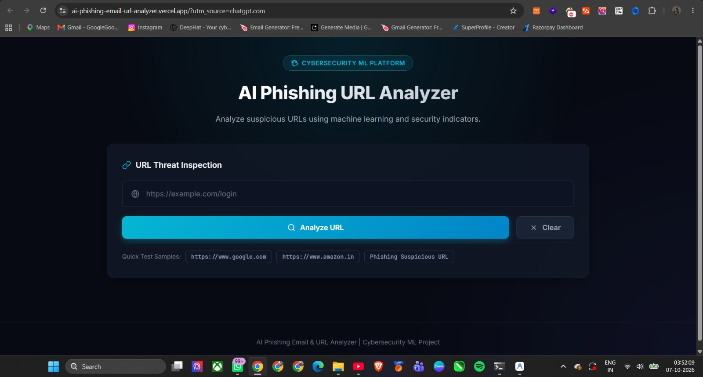
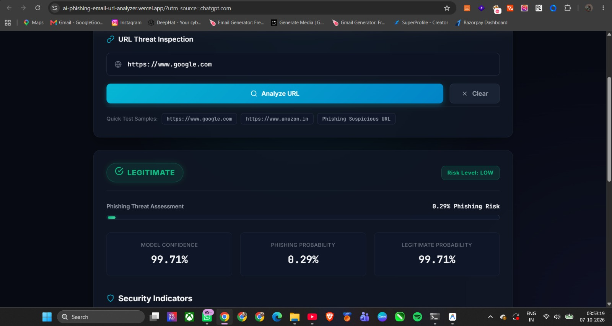
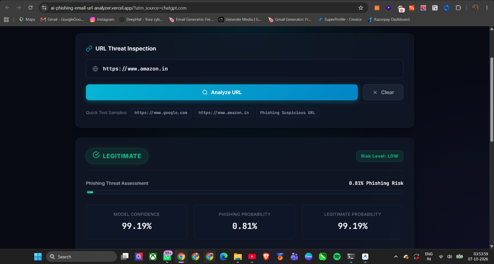
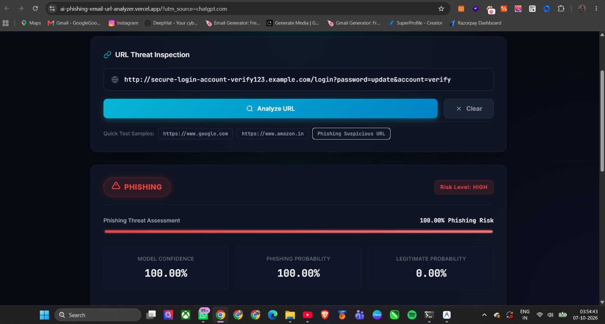
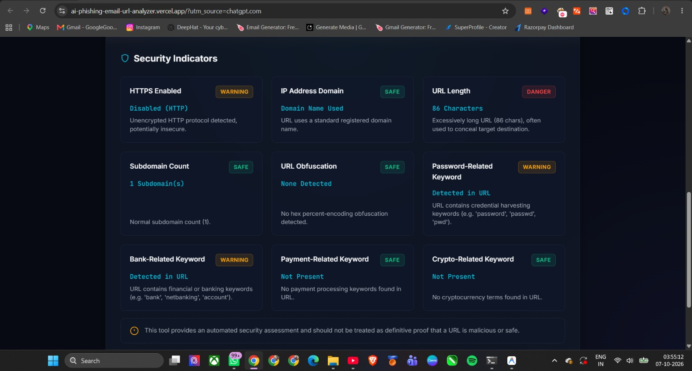

# AI Phishing URL Analyzer

A defensive cybersecurity machine-learning application designed to analyze suspicious URLs and evaluate whether they are likely **LEGITIMATE** or **PHISHING**. The system extracts 22 structural URL indicators and uses a trained **Random Forest** classifier to calculate risk levels, model confidence, and probability metrics.

---

## Live Demo

[](https://ai-phishing-email-url-analyzer.vercel.app/)

**Live Application URL**: [https://ai-phishing-email-url-analyzer.vercel.app/](https://ai-phishing-email-url-analyzer.vercel.app/)

---

## GitHub Repository

[https://github.com/Gourishkhatri/AI-Phishing-Email-URL-Analyzer](https://github.com/Gourishkhatri/AI-Phishing-Email-URL-Analyzer)

---

## Features

- **URL Phishing Classification**: Automated classification into `LEGITIMATE` or `PHISHING`.
- **Random Forest ML Engine**: Powered by a trained Random Forest model (`url_only_random_forest.joblib`).
- **URL Feature Extraction**: Real-time extraction of 22 structural and lexical URL metrics.
- **Probabilistic Scoring**: Provides exact Phishing Probability and Legitimate Probability scores.
- **Model Confidence**: Displays prediction confidence percentage.
- **Risk Assessment**: Categorizes threat potential into `LOW`, `MEDIUM`, or `HIGH` risk levels.
- **Security Indicators**: Evaluates 9 security indicators including HTTPS status, raw IP usage, subdomain count, obfuscation, and keyword triggers.
- **Flask REST API**: Exposes a `POST /api/analyze` REST endpoint for backend integration.
- **Responsive Dashboard**: Dark cybersecurity UI designed for desktop and mobile devices.
- **Serverless Ready**: Configured for Vercel deployment via `@vercel/python`.

---

## Screenshots

### Dashboard


### Legitimate URL Analysis


### Amazon Legitimate URL Analysis


### Phishing Detection


### Security Indicators


---

## Technology Stack

- **Language**: Python 3.11+
- **Backend Framework**: Flask
- **Machine Learning**: Scikit-learn, Joblib
- **Data Processing**: Pandas, NumPy
- **Frontend**: HTML5, Vanilla CSS3 (Glassmorphism Dark Cybersecurity Theme), Vanilla JavaScript
- **Version Control & CI/CD**: Git, GitHub, Vercel

---

## Machine Learning

The classifier is built using a **Random Forest** ensemble model trained specifically on URL-derived lexical and structural features.

### URL-Only Model Performance

| Metric | Score | Percentage |
| :--- | :--- | :--- |
| **Accuracy** | `0.995220` | **99.5220%** |
| **Precision** | `0.997248` | **99.7248%** |
| **Recall** | `0.991544` | **99.1544%** |
| **F1 Score** | `0.994388` | **99.4388%** |

### Engineering Context: URL-Only Classifier Selection

The original dataset contained features requiring active webpage/DOM fetching (e.g., HTML element counts, external JS scripts, iframe anchors). To ensure the analysis tool remains non-intrusive, fast, and secure without initiating live network requests or executing untrusted code on target servers, a dedicated **URL-only model** was trained using exclusively features computable directly from the raw URL string.

> [!NOTE]  
> Machine learning models are probabilistic engines and are not 100% accurate. Predictions should be evaluated alongside secondary security layers.

---

## Dataset

- **Dataset**: UCI PhiUSIIL Phishing URL Dataset
- **Source**: [https://archive.ics.uci.edu/dataset/967/phiusil-phishing-url-dataset](https://archive.ics.uci.edu/dataset/967/phiusil-phishing-url-dataset)
- **Record Count**: The raw dataset contained **235,795 records**. After removing **425 duplicate URLs**, the final cleaned dataset comprised **235,370 unique records**.

---

## URL Features

The model processes **22 URL-computable features** extracted by `src/url_feature_extractor.py`:

1. `URLLength` – Total length of the URL.
2. `DomainLength` – Character length of the host domain.
3. `IsDomainIP` – Binary flag indicating if the domain is a raw IPv4 address.
4. `TLDLength` – Length of the top-level domain suffix.
5. `NoOfSubDomain` – Number of subdomain levels present.
6. `HasObfuscation` – Indicates presence of percent-encoded hex sequences.
7. `NoOfObfuscatedChar` – Total count of percent-encoded characters.
8. `ObfuscationRatio` – Ratio of obfuscated characters to total URL length.
9. `NoOfLettersInURL` – Count of alphabetic characters.
10. `LetterRatioInURL` – Ratio of alphabetic characters to URL length.
11. `NoOfDegitsInURL` – Count of numeric digits.
12. `DegitRatioInURL` – Ratio of numeric digits to URL length.
13. `NoOfEqualsInURL` – Count of `=` characters in query parameters.
14. `NoOfQMarkInURL` – Count of `?` characters.
15. `NoOfAmpersandInURL` – Count of `&` characters.
16. `NoOfOtherSpecialCharsInURL` – Count of non-alphanumeric structural special characters.
17. `SpacialCharRatioInURL` – Ratio of special characters to total URL length.
18. `IsHTTPS` – Binary flag indicating secure HTTPS protocol scheme usage.
19. `HasPasswordField` – Detection of credential harvesting terms (`password`, `passwd`, `pwd`).
20. `Bank` – Detection of banking keywords (`bank`, `banking`, `netbanking`, `account`).
21. `Pay` – Detection of payment keywords (`pay`, `payment`, `checkout`, `billing`).
22. `Crypto` – Detection of cryptocurrency keywords (`bitcoin`, `crypto`, `wallet`, `ethereum`).

---

## Architecture

```
User URL Input
      ↓
Frontend Dashboard (HTML5 / Vanilla CSS / JS)
      ↓
POST /api/analyze (JSON Payload)
      ↓
Flask REST API (app.py)
      ↓
URL Feature Extractor (src/url_feature_extractor.py)
      ↓
Random Forest Classifier (model/url_only_random_forest.joblib)
      ↓
Prediction Output + Probabilities + Risk + Security Indicators
      ↓
Frontend Dashboard Result Rendering
```

---

## API Documentation

### `POST /api/analyze`

Analyzes a target URL string and returns prediction results, probability distributions, risk rating, and individual security indicators.

#### Request Body
```json
{
  "url": "https://www.google.com"
}
```

#### Response Example
```json
{
  "prediction": "LEGITIMATE",
  "confidence": 99.71,
  "phishing_probability": 0.29,
  "legitimate_probability": 99.71,
  "risk": "LOW",
  "indicators": [
    {
      "id": "https",
      "name": "HTTPS Enabled",
      "value": "Enabled",
      "status": "safe",
      "description": "Secure SSL/TLS encryption detected on URL connection."
    },
    {
      "id": "ip_domain",
      "name": "IP Address Domain",
      "value": "Domain Name Used",
      "status": "safe",
      "description": "URL uses a standard registered domain name."
    },
    {
      "id": "url_length",
      "name": "URL Length",
      "value": "22 Characters",
      "status": "safe",
      "description": "Standard concise URL length (22 chars)."
    },
    {
      "id": "subdomains",
      "name": "Subdomain Count",
      "value": "1 Subdomain(s)",
      "status": "safe",
      "description": "Normal subdomain count (1)."
    },
    {
      "id": "obfuscation",
      "name": "URL Obfuscation",
      "value": "None Detected",
      "status": "safe",
      "value": "None Detected"
    }
  ]
}
```

---

## Verified Live Test Results

The application and model were verified against the following test inputs:

1. **`https://www.google.com`**
   - **Prediction**: `LEGITIMATE`
   - **Confidence**: `99.71%`
   - **Risk Level**: `LOW`

2. **`https://www.amazon.in`**
   - **Prediction**: `LEGITIMATE`
   - **Confidence**: `99.19%`
   - **Risk Level**: `LOW`

3. **`http://secure-login-account-verify123.example.com/login?password=update&account=verify`** *(Synthetic Test Input)*
   - **Prediction**: `PHISHING`
   - **Confidence**: `100.00%`
   - **Risk Level**: `HIGH`

> [!IMPORTANT]  
> The third test URL is a synthetic test vector designed to evaluate keyword and structural triggers. The system operates passively and did **not** open, visit, or resolve the URL.

---

## Project Structure

```text
AI-Phishing-Email-URL-Analyzer/
├── dataset/
│   ├── raw/                  # Original UCI PhiUSIIL dataset
│   └── processed/            # Preprocessed feature extracted CSV data
├── model/
│   ├── url_only_random_forest.joblib  # Trained Random Forest classifier
│   └── url_only_features.txt          # Feature list specification
├── reports/                  # Model evaluation reports & CSV metrics
├── src/
│   ├── url_feature_extractor.py       # Live URL feature extraction logic
│   ├── predict_url.py                 # CLI prediction script
│   └── train_url_only_model.py        # Model training script
├── static/
│   ├── css/
│   │   └── style.css         # Modern dark cybersecurity dashboard styles
│   └── js/
│       ├── api.js            # Modular REST API client service
│       └── app.js            # UI interaction & indicator rendering logic
├── templates/
│   └── index.html            # Main HTML5 dashboard template
├── app.py                    # Flask server & REST API routes
├── requirements.txt          # Python dependencies
├── vercel.json               # Vercel serverless configuration
└── README.md                 # Project documentation
```

---

## Local Setup

Follow these steps to run the application locally on Windows:

1. **Clone the Repository**:
   ```bash
   git clone https://github.com/Gourishkhatri/AI-Phishing-Email-URL-Analyzer.git
   cd AI-Phishing-Email-URL-Analyzer
   ```

2. **Create a Virtual Environment**:
   ```cmd
   python -m venv venv
   ```

3. **Activate the Virtual Environment**:
   ```cmd
   venv\Scripts\activate
   ```

4. **Install Dependencies**:
   ```cmd
   pip install -r requirements.txt
   ```

5. **Start the Flask Application**:
   ```cmd
   python app.py
   ```

6. **Open in Browser**:
   Navigate to `http://127.0.0.1:5000`

---

## Deployment

The application is deployed on **Vercel** using `@vercel/python` serverless functions. Push events to the `main` branch on GitHub trigger automated Vercel builds that compile Python dependencies and deploy the WSGI application instance configured in `vercel.json`.

---

## Security & Ethical Use

- **Defensive Purpose**: This software is designed exclusively as a defensive security analysis tool.
- **Passive Analysis**: The backend performs passive structural analysis on the URL string and **never** opens, visits, or connects to target URLs.
- **Synthetic Validation**: All malicious validation tests were conducted using synthetic string inputs.
- **Assessment Disclaimer**: This tool provides automated security evaluations based on statistical indicators and should not be treated as definitive proof that a URL is safe or malicious.
- **Ethical Usage**: Do not use this codebase for phishing, credential harvesting, malware dissemination, or unauthorized security testing.

---

## Limitations

- **No Webpage Content Inspection**: URL-only feature extraction cannot inspect active DOM elements, SSL certificate validity, or rendered HTML content.
- **Evasion Possibility**: Advanced phishing attacks using legitimate-looking domain structures or shorteners may evade detection.
- **Content Drift**: Legitimate domain names can potentially host malicious sub-paths or compromised content.
- **Probabilistic Output**: Machine learning predictions are based on dataset patterns and may yield false positives or false negatives.

---

## Future Improvements

- **Email Phishing Analysis**: Extend support to full raw email header and body text inspection.
- **HTML & DOM Feature Extractor**: Add an optional sandbox runner for active webpage DOM analysis.
- **Explainable AI (SHAP / LIME)**: Integrate feature importance visualization for individual predictions.
- **Expanded Datasets**: Train on larger, real-time threat intelligence feeds.
- **Model Comparison Dashboard**: Include side-by-side performance comparisons across multiple ML algorithms.
- **Threat Intelligence Integration**: Integrate external reputation API lookups (e.g., VirusTotal, Google Safe Browsing).
- **Automated Test Suite**: Expand unit test coverage for feature extraction edge cases.

---

## Author

**Gourish Khatri**  
Cybersecurity Student | B.Tech Cyber Security  
JIET College  

- **GitHub**: [https://github.com/Gourishkhatri](https://github.com/Gourishkhatri)
- **LinkedIn**: [https://www.linkedin.com/in/gourish-khatri-972b89290/](https://www.linkedin.com/in/gourish-khatri-972b89290/)
